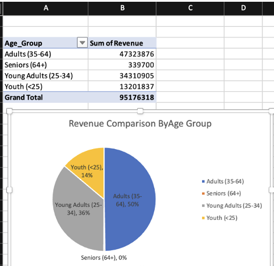
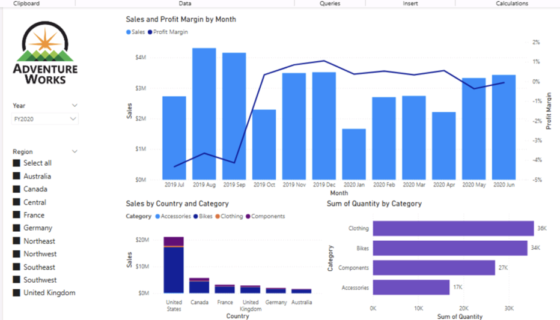
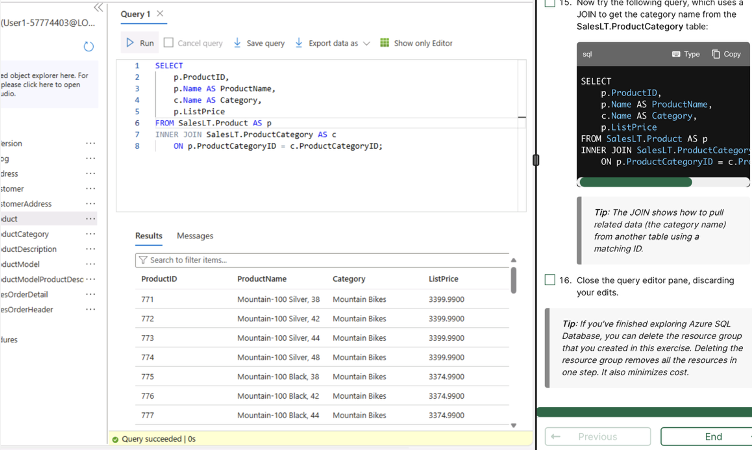
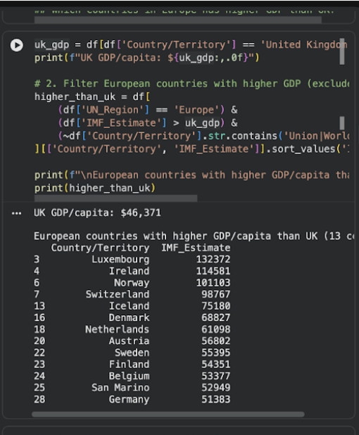

# Data Technician Portfolio

This repository documents my progression through a structured **Data Technician training programme**, covering **data governance, analysis, visualisation, databases, cloud platforms, SQL, and Python**.  
Each week builds on the previous one, demonstrating both technical depth and applied, real-world problem solving.

---

## Week 1 – Data Compliance & Excel Analysis

**Focus:** Data protection, regulatory awareness, and foundational data analysis using Excel.

### Key Learning Outcomes
- Applied UK data legislation:
  - GDPR  
  - Data Protection Act  
  - Freedom of Information Act  
  - Computer Misuse Act
- Explained legal, ethical, and commercial implications of data handling.
- Analysed retail datasets using **Excel tables, sorting, and formulas**.
- Used core functions including **SUM, AVERAGE, MAX, and SUMIF**.
- Built **Pivot Tables** to identify revenue trends and customer insights.
- Prepared data-driven findings for **board-level communication**.

### Tools Used
- Microsoft Excel  
- Pivot Tables  
- Data Analysis Functions  



### Excel Chart Key Insights

- **Adults (35–64)** contribute the largest share of revenue at approximately **50%**.
- **Young Adults (25–34)** account for around **36%**, making them the second most valuable segment.
- **Youth (<25)** contribute roughly **14%** of total revenue.
- **Seniors (64+)** generate a negligible share of revenue in comparison.
---

## Week 2 – Data Visualisation & Power BI

**Focus:** Visual storytelling, exploratory data analysis, and dashboard design.

### Key Learning Outcomes
- Compared **Tableau versions** (Public, Desktop, Creator, Explorer, Viewer) and their use cases.
- Designed dashboards using:
  - Bar charts
  - Maps
  - Bubble charts
- Conducted **exploratory analysis** on:
  - Spotify music data (popularity, genre, artist trends)
  - Health datasets (trend analysis with NHS decision-making context)
- Completed **Power BI labs** covering:
  - Data ingestion
  - Transformation
  - Report design
- Documented technical limitations and troubleshooting clearly.

### Tools Used
- Tableau  
- Power BI Desktop  
- Data Visualisation Techniques  


### Tableau Dashboard Key Insights
- Life expectancy has generally increased over time, with notable variation between continents.
- Higher BMI does not always correlate with higher life expectancy, indicating complex health factors.
- Certain regions show elevated stomach cancer rates, suggesting environmental or lifestyle influences.
- Population growth patterns vary significantly by geography and economic development.
- Gender differences in BMI are consistent across most continents.



### PowerBI Dashboard Key Insights
- Sales peak during late 2019, with noticeable volatility in early 2020.
- Profit margins fluctuate independently of sales volume, highlighting pricing and cost influences.
- The **United States** is the strongest revenue contributor across categories.
- **Clothing and Bikes** generate the highest unit sales volumes.
- Regional filtering enables targeted performance analysis by market.
---

## Week 3 – Databases & SQL

**Focus:** Relational database design, querying, and structured data analysis.

### Key Learning Outcomes
- Explained **database fundamentals**:
  - Primary and foreign keys
  - Table relationships (1-1, 1-many, many-many)
- Compared **relational vs non-relational databases** and use cases.
- Designed a **retail database schema** for inventory, sales, customers, and loyalty data.
- Wrote SQL for:
  - Database and table creation
  - Data insertion
  - Joins (INNER, LEFT, RIGHT, FULL, CROSS, SELF)
- Solved real-world SQL scenarios using global datasets:
  - Population analysis
  - Life expectancy
  - GDP
  - Capital cities

### Tools Used
- SQL (MySQL-style syntax)  
- Relational Database Design  


### SQL Query

```sql
SELECT Name, CountryCode
FROM city
WHERE Name LIKE '%New%';
```
### What This Query Does
- Selects **city names** and their associated **country codes**.
- Uses the `LIKE` operator with wildcard characters (`%`) to match any city name containing the substring **"New"**.
- Returns results from **multiple countries**, enabling global text-based filtering and comparison.
---

## Week 5 – Cloud Computing & Microsoft Azure

**Focus:** Cloud concepts, data governance, and enterprise-scale data architecture.

### Key Learning Outcomes
- Explained **cloud computing fundamentals** and business benefits.
- Compared **IaaS, PaaS, and SaaS** service models.
- Evaluated **Public, Private, Hybrid, and Community Cloud** deployments.
- Applied UK data laws in cloud environments:
  - GDPR
  - Data Protection Act 2018
  - Computer Misuse legislation
- Completed Azure labs exploring:
  - Relational data
  - Non-relational data
  - Analytics services
- Designed an **Azure data architecture proposal** for a retail business:
  - Azure SQL Database
  - Azure Blob Storage
  - Azure Synapse Analytics
  - Azure Machine Learning
  - Azure Data Factory
- Addressed **security, encryption, backup, disaster recovery, and scalability**.

### Tools Used
- Microsoft Azure  
- Azure SQL Database  
- Azure Blob Storage  
- Azure Synapse Analytics  
- Azure Data Factory  
- Power BI  

### Exploring Relational Data in Azure



```sql
SELECT
    p.ProductID,
    p.Name AS ProductName,
    c.Name AS Category,
    p.ListPrice
FROM SalesLT.Product AS p
INNER JOIN SalesLT.ProductCategory AS c
    ON p.ProductCategoryID = c.ProductCategoryID;
```
### What This Query Does
- Retrieves product details including **Product ID, Product Name, Category, and List Price**.
- Uses an **INNER JOIN** to link products with their corresponding categories.
- Matches records based on the shared **ProductCategoryID** field.
- Demonstrates how to pull **related data from multiple tables** in a relational database.
---

## Week 6 – Python & Pandas Data Analysis

**Focus:** Programming fundamentals and data analysis using Python.

### Key Learning Outcomes
- Implemented **Python logic and control flow** (FizzBuzz).
- Loaded and explored CSV data using **Pandas**.
- Performed:
  - Indexing and slicing
  - Data cleaning and transformation
  - Aggregation and grouping
- Built **pivot tables** and derived categorical features (grades, pass/fail).
- Exported transformed datasets for reuse.
- Analysed **GDP per capita data** using Jupyter Notebook.
- Practised exploratory analysis and optional visualisation.

### Tools Used
- Python  
- Pandas  
- Jupyter Notebook  

---

## Core Skills Demonstrated

- Data analysis and interpretation  
- Data governance and regulatory compliance  
- SQL querying and database design  
- Data visualisation and storytelling  
- Cloud architecture fundamentals  
- Python programming and data wrangling  
- Translating business requirements into technical solutions  

---

## Tools & Technologies Summary

- Microsoft Excel  
- SQL  
- Python (Pandas)  
- Power BI  
- Tableau  
- Microsoft Azure  
- Jupyter Notebook  


### Python Code Example

```python
# UK GDP per capita
uk_gdp = df[df['Country/Territory'] == 'United Kingdom']['IMF_Estimate'].iloc[0]
print(f"UK GDP/capita: ${uk_gdp:,.0f}")

# Filter European countries with higher GDP per capita than the UK
higher_than_uk = df[
    (df['UN_Region'] == 'Europe') &
    (df['IMF_Estimate'] > uk_gdp) &
    (~df['Country/Territory'].str.contains('Union|World'))
][['Country/Territory', 'IMF_Estimate']].sort_values(
    by='IMF_Estimate', ascending=False
)

print("\nEuropean countries with higher GDP/capita than UK")
print(higher_than_uk)
```

### What This Code Does
- Extracts the **UK GDP per capita** value from the dataset.
- Filters the dataset to include only **European countries**.
- Identifies countries with a **higher GDP per capita than the UK**.
- Excludes aggregate regions such as **World** or **Union**.
- Sorts results in **descending order** to highlight top-performing economies.
---

## About This Portfolio

This repository represents a **progressive, hands-on learning journey**, demonstrating both **technical capability** and **business-focused data thinking**. Each week builds practical experience aligned with **junior data analyst, data technician, and marketing analytics roles**.
